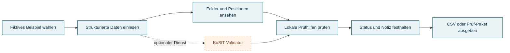

# Rechnungsklar

<p align="center">
  
</p>

<p align="center">
  
  
  
  
</p>

<p align="center">
  <a href="https://rechnungsklar.streamlit.app/">
    
  </a>
</p>

**Rechnungsklar** ist ein deutschsprachiger Portfolio-Prototyp für den digitalen Rechnungseingang. Er macht strukturierte Rechnungsdaten lesbar, zeigt lokale Prüfhilfen und bildet einen einfachen Prüfablauf ab.

> **Demo-Hinweis:** Diese öffentliche Demo arbeitet ausschließlich mit fiktiven Beispieldaten. Der Datei-Upload ist im Demo-Modus deaktiviert. Bitte keine echten oder vertraulichen Rechnungen hochladen.

## Was du ausprobieren kannst

- Fiktive UBL-Rechnungsbeispiele einlesen und erkannte Daten in einer Belegansicht ansehen.
- Lieferant, Rechnungsnummer, Daten, Steuer- und Gesamtbeträge sowie Positionen prüfen, soweit sie in der Datei vorhanden sind.
- Lokale Hinweise zu fehlenden oder nicht erkannten Feldern nachvollziehen.
- Prüfstatus und Notiz im aktuellen Arbeitsschritt ansehen.
- Beispielbestand nach Lieferant oder Workflow-Status aufschlüsseln und als CSV oder Prüf-Paket ausgeben.
- Mit der optionalen Produkttour die wichtigsten Bereiche kennenlernen.

## So läuft die Prüfung ab



## Unterstützte Daten und Funktionen

| Bereich | Stand des Prototyps |
|---|---|
| Strukturierte XML-Daten | UBL-Rechnungen und -Gutschriften sowie CII-Daten werden verarbeitet. |
| ZUGFeRD-PDF | Eingebettetes Rechnungs-XML und lesbarer PDF-Text können ausgelesen werden. |
| Feldübersicht | Absender, Empfänger, Datumsangaben, IBAN, Beträge und Positionen – sofern vorhanden und erkannt. |
| Lokale Prüfhilfen | Hinweise auf wichtige Felder, die fehlen oder nicht erkannt wurden. Das ist keine EN-16931-Regelprüfung. |
| Prüfung im Team | Einfacher Bearbeitungsstatus und Notiz im aktuellen Streamlit-Sitzungsspeicher. |
| Ausgabe | CSV-Übersicht und individuelles Prüf-Paket als ZIP. Beides ist kein revisionssicheres Archiv. |
| KoSIT | Optionaler externer Validator für eine passende, konfigurierte KoSIT-Version und XRechnung-Szenariokonfiguration. |

## Lokal starten

Voraussetzungen: Ubuntu/WSL oder Linux mit Python 3.11 oder neuer.

```bash
git clone https://github.com/Gilles177/rechnungsklar.git
cd rechnungsklar
python3 --version
python3 -m venv .venv
source .venv/bin/activate
python -m pip install --upgrade pip
pip install -r requirements.txt
streamlit run app.py
```

Streamlit zeigt die lokale App-Adresse im Terminal an. In der Seitenleiste kannst du einen fiktiven Demo-Arbeitsplatz laden oder die Produkttour einschalten.

## Auf Streamlit Community Cloud bereitstellen

1. Das GitHub-Repository `Gilles177/rechnungsklar` mit Streamlit Community Cloud verbinden.
2. Den Branch `main` und die Einstiegsdatei `app.py` auswählen.
3. Die Abhängigkeiten werden aus `requirements.txt` installiert.

Der öffentliche Portfolio-Modus ist in `app.py` standardmäßig aktiv. Er blendet den Datei-Upload aus und verarbeitet nur Beispieldaten. Zugangsdaten oder private Konfiguration gehören nicht in das GitHub-Repository. Falls ein KoSIT-Dienst genutzt wird, die URL als Streamlit-Secret konfigurieren und den Validator nur über einen geschützten, erreichbaren Dienst anbinden.

## Datenschutz und bewusste Grenzen

- Der öffentliche Demo-Modus deaktiviert den Datei-Upload. Die eingebauten Beispieldaten sind fiktiv.
- Demo-Datensätze liegen nur im Sitzungsspeicher. Die App bietet derzeit keine Benutzerkonten, Firmen-Arbeitsbereiche, dauerhafte Dokumentablage oder GoBD-Archivierung.
- Die lokalen Feldhinweise sagen nicht aus, ob eine Rechnung EN-16931-konform oder steuerlich korrekt ist.
- Ein KoSIT-Ergebnis hängt von der eingebundenen Validator- und Konfigurationsversion ab. Es ist keine Steuerberatung und garantiert keine steuerliche Anerkennung.
- Ein einfaches PDF ohne strukturierte Rechnungsdaten wird nicht in eine E-Rechnung umgewandelt. Bei ZUGFeRD gehören sichtbares PDF und eingebettetes XML zusammen betrachtet.
- CSV- und ZIP-Ausgaben sind Prüf-Hilfen, keine Buchhaltungsintegration und kein revisionssicheres Archiv.

Vor einem Einsatz mit echten Unternehmensdaten wären mindestens Anmeldung, mandantengetrennte Zugriffsrechte, geschützte dauerhafte Speicherung, Lösch- und Aufbewahrungsregeln, Backups sowie ein geprüfter Hosting- und Datenschutzbetrieb erforderlich.

## Projektstruktur

```text
app.py                         Streamlit-Oberfläche und Demo-Ablauf
requirements.txt               Python-Abhängigkeiten
rechnungsklar/
  models.py                    Datenmodelle für Belege und Prüfung
  parser.py                    XML- und ZUGFeRD-Auslesen
  validation.py                Lokale Hinweise und optionaler KoSIT-Aufruf
  exports.py                   CSV- und Prüf-Paket-Erstellung
assets/
  rechnungsklar-banner.svg     Titelgrafik für diese README
```

## Nächste Entwicklungsschritte

1. Weitere repräsentative, ausschließlich synthetische UBL-, CII- und ZUGFeRD-Beispiele ergänzen.
2. KoSIT-Regelhinweise mit verständlichen deutschen Erläuterungen versehen und Original-Regelkennungen erhalten.
3. Einen gezielten XML/PDF-Abgleich mit menschlicher Bestätigung entwickeln.
4. Mit Handwerksbetrieben und Buchhaltungsbüros den konkreten Arbeitsablauf und Exportbedarf validieren.
5. Erst danach Anmeldung, Mandantentrennung und geschützte dauerhafte Ablage aufbauen.

## Lizenz

Diesem Repository liegt derzeit keine Open-Source-Lizenz bei. Die öffentliche Sichtbarkeit des Codes bedeutet daher nicht automatisch, dass eine Weiterverwendung erlaubt ist.

---

Entwickelt als Portfolio-Projekt · [Gilles177 auf GitHub](https://github.com/Gilles177)
